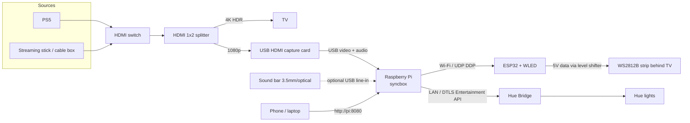
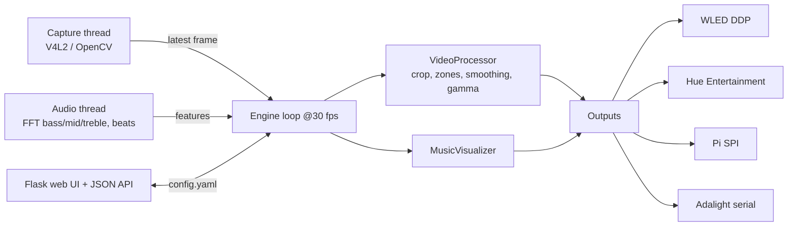

# DIY Philips Hue Sync Box

A build-it-yourself alternative to the Philips Hue Play HDMI Sync Box: it captures whatever is on your TV, works out the colours around the edge of the picture, and pushes them to addressable LED strips behind the TV and, optionally, to your existing Philips Hue lights. Audio from the same HDMI signal (or from your sound bar) adds beat-reactive effects.

This repository contains the **complete guide** (hardware, wiring, software) and **working code** for every part of the pipeline:

| Part | What it is | Status |
|---|---|---|
| `pi/` | Python application for the Raspberry Pi: capture, colour extraction, smoothing, audio analysis, web UI, outputs for WLED, Adalight, Pi SPI and Hue Entertainment | 27 unit tests pass; end-to-end tested with a synthetic source. Hue DTLS streaming is written against the published protocol but needs your bridge to verify |
| `esp32/` | Minimal ESP32 firmware that receives frames over Wi-Fi (DDP) or USB serial (Adalight) and drives WS2812B. You can use [WLED](https://kno.wled.ge) instead and skip this entirely | See `docs/04-setup-guide.md` for build notes |
| `docs/` | Step-by-step guide: bill of materials, signal chain, wiring diagrams, software architecture, setup, troubleshooting | |
| `tools/` | Hue pairing helper, device lister | |

Total cost for a complete system including the lights is **about $110 to $170**, against roughly $250 for the official box plus $180 or more for a Hue gradient light strip.

---

## Read this first: what can actually be captured

The official Sync Box and this project both sit **between your HDMI sources and the TV**. Nothing can capture what a smart TV shows from its own built-in apps, because that picture never leaves the TV over HDMI. The same is true for the official box.

So the inputs are your **sources**: PS5, Xbox, Switch, Apple TV, Fire Stick, Chromecast, cable box, PC. If you watch Netflix in the TV's own app, move that to a $30 to $50 streaming stick and it becomes syncable. The TV itself is the *output* of the chain.

The audio you hear from the sound bar is inside the same HDMI signal, so the capture card gives you audio for free. A separate 3.5 mm or optical feed from the sound bar is optional and covered in the guide.

---

## Answers to your questions

### 1. What hardware is needed and where do I get it?

The recommended build. Prices are typical 2026 street prices from Amazon, AliExpress, Adafruit, The Pi Hut or your local Pi reseller. Full alternatives and a budget tier are in [docs/01-hardware-and-bom.md](docs/01-hardware-and-bom.md).

| # | Part | Why | Approx. |
|---|---|---|---|
| 1 | Raspberry Pi 4 (2 GB) or Pi 5 | Decodes the capture stream and runs the colour maths. An ESP32 cannot do this part | $45 to $60 |
| 2 | microSD 32 GB + official Pi USB-C supply | | $18 |
| 3 | USB HDMI capture dongle, MS2130 chip (1080p60, USB 3) or MS2109 (1080p30, USB 2) | Turns HDMI into a plain webcam stream Linux understands with no drivers | $12 to $30 |
| 4 | HDMI 1x2 splitter, 4K60, ideally with a "downscaler" output | One output feeds the TV at full quality, the other feeds the capture card at 1080p | $20 to $35 |
| 5 | HDMI switch, 3x1 or 4x1 (only if you have more sources than you want to re-plug) | All sources go through one splitter | $15 to $25 |
| 6 | ESP32 dev board (ESP32-WROOM DevKit) | Drives the LEDs over Wi-Fi with WLED, so the strip needs no cable to the Pi | $5 to $8 |
| 7 | WS2812B 5 V LED strip, 60 LEDs/m, 5 m, IP30 | Addressable RGB; 5 m covers up to a 75" TV with margin | $18 to $25 |
| 8 | 5 V 10 A power supply (or 5 V 20 A for 300+ LEDs at full brightness) | LEDs draw up to 60 mA each | $12 to $18 |
| 9 | 74AHCT125 level shifter (or SN74AHCT125N DIP) | Converts 3.3 V data to 5 V for reliable LED data | $1 to $3 |
| 10 | 1000 uF 6.3 V+ capacitor, 330 ohm resistor, 18 AWG wire, 3-pin JST connectors, inline fuse, DC barrel jack | Standard LED-strip hygiene | $10 |
| 11 | Optional: aluminium channel with diffuser, double-sided tape | Even light, no hot spots | $10 to $20 |
| 12 | Optional: USB sound card with line-in, or TOSLINK-to-analog DAC | Only if you want sound-bar audio instead of HDMI audio | $8 to $15 |

### 2. How do I capture HDMI video?

```
PS5 ─┐
     ├─► HDMI switch ─► HDMI 1x2 splitter ─┬─► TV (4K HDR, untouched)
TV box┘                                     └─► USB capture card ─► Raspberry Pi
```

The capture card is a USB Video Class device, so on Linux it appears as `/dev/video0` and OpenCV reads it like a webcam. We ask it for 640x360 (or 1280x720) MJPEG at 30 to 60 fps, which is more than enough to average colours from. The details, including HDCP, HDR and 4K120 caveats, are in [docs/02-signal-chain-and-wiring.md](docs/02-signal-chain-and-wiring.md).

### 3. What is the best microcontroller?

Use **two** boards, each doing what it is good at:

- **Raspberry Pi 4 or 5** does capture and processing. Decoding a USB video stream needs a real USB host stack, a few hundred MB of RAM and a CPU that can crunch a frame in a couple of milliseconds. An Arduino or ESP32 cannot do this. A Pi Zero 2 W works at lower frame rates (about 15 to 20 fps at 320x180) if you want the cheapest build.
- **ESP32** drives the strip. It sits next to the LEDs, receives colours over Wi-Fi (or a USB cable), and clocks out the WS2812B signal with perfect timing. Flash it with WLED and you get a web UI, effects and a static-colour fallback without writing a line of code.

You can skip the ESP32 and wire the strip straight to the Pi's SPI pin through a level shifter. That is cheaper, but the Pi must then live right behind the TV and Pi 5 support for other bit-banging libraries is poor. The SPI path is implemented in `pi/syncbox/outputs/rpi_spi.py`.

### 4. How should I process the video to extract colours efficiently?

Per frame, in `pi/syncbox/processor.py`:

1. **Shrink** the frame to 256x144 with area averaging. Everything after this is cheap.
2. **Detect black bars** (letterbox or pillarbox) from row and column luminance and crop them, with a hold-off so a dark scene is not mistaken for a bar.
3. **Sample zones.** Each LED owns a rectangle on the picture edge (the outer 8 % by default). A summed-area table lets us compute the mean colour of every rectangle at once in one vectorised numpy expression, so 300 LEDs cost about the same as 10.
4. **Black threshold** removes sensor noise so dark scenes are truly dark.
5. **Saturation boost** because averaged colours are always a bit grey.
6. **Scene-adaptive brightness** scales the output with the frame's overall luminance.
7. **Temporal smoothing** with an asymmetric exponential filter: fast attack, slower release, frame-rate independent. The Game, Video and Movie modes are just different time constants.
8. **Spatial smoothing** blurs across neighbouring LEDs to hide compression noise.
9. **Gamma** and per-strip white balance so the colour on the wall matches the screen.

On a Pi 4 the whole pipeline runs in about 3 ms per frame. See [docs/03-software-architecture.md](docs/03-software-architecture.md).

### 5. Can it be wireless?

Partly. The Pi must be wired into the HDMI chain. Everything after it can be wireless:

- LED strip: ESP32 + WLED over Wi-Fi, using the DDP protocol on UDP port 4048. Adds 5 to 15 ms of latency on a decent 2.4 GHz network.
- Hue lights: streamed to the Hue Bridge over your LAN using the Entertainment API.
- Configuration: from any phone or laptop via the Pi's web UI on port 8080.

If your Wi-Fi is congested, run a USB cable from the Pi to the ESP32 instead and use the Adalight serial output. Same firmware, zero wireless.

### 6. What is a realistic build cost?

| Tier | What | Total |
|---|---|---|
| Budget | Pi Zero 2 W, MS2109 capture, basic 4K splitter, LEDs wired straight to the Pi (no ESP32), 5 m WS2812B, 5 V 10 A supply | about $100 to $115 |
| Recommended | Pi 4 2 GB, MS2130 capture, 4K splitter with downscaler, ESP32 + WLED, 5 m WS2812B, 5 V 10 A supply, level shifter, connectors | about $150 to $170 |
| Already own a Pi | Everything above minus the Pi, card and supply | about $95 to $110 |
| Add Hue | Nothing extra if you already own a Hue Bridge v2 and colour lights | $0 |

For comparison the official box is around $250, and the Hue gradient light strip it is usually paired with is another $180 to $230.

### 7. Are there existing open-source projects to build on?

Yes, and you should know about them before you write anything:

| Project | What it does | How it relates |
|---|---|---|
| [HyperHDR](https://github.com/awawa-dev/HyperHDR) | Complete ambilight server: USB grabbers, HDR tone mapping, black-bar detection, Hue Entertainment, WLED, Adalight, audio-reactive effects, web UI. Runs on Pi 4/5 and Zero 2 W | The no-code path. If you only want the result, install HyperHDR + WLED and you are done in an evening. See [docs/05-fast-path-hyperhdr.md](docs/05-fast-path-hyperhdr.md) |
| [Hyperion.ng](https://github.com/hyperion-project/hyperion.ng) | The original, HyperHDR forked from it | Similar; HyperHDR has better USB-grabber and HDR handling |
| [WLED](https://github.com/Aircoookie/WLED) | ESP32/ESP8266 LED firmware with realtime UDP input, effects, an audio-reactive usermod and a great web UI | This repo streams to it. Recommended over the `esp32/` firmware here |
| [diyHue](https://github.com/diyhue/diyHue) | Emulates a Hue Bridge so WLED strips appear as Hue lights, including Entertainment streaming | Lets the official Hue Sync desktop app or even a real Sync Box drive your DIY strip |
| [FastLED](https://github.com/FastLED/FastLED), [NeoPixelBus](https://github.com/Makuna/NeoPixelBus), [rpi_ws281x](https://github.com/jgarff/rpi_ws281x) | LED driver libraries | Used by the ESP32 firmware; rpi_ws281x is the PWM alternative to our SPI output on Pi 4 and older |

The code in this repo re-implements the core of HyperHDR in about 1,200 lines of readable Python so you can see how each feature works and change it. It is a learning and customisation platform, not a replacement for HyperHDR's years of polish.

---

## System overview



Software pipeline on the Pi:



---

## Build steps

1. **Order the parts** from the table above ([details](docs/01-hardware-and-bom.md)).
2. **Measure your TV** and count LEDs per edge. 60 LEDs/m on a 65" TV is about 85 top, 48 side, 85 bottom, 48 side; you can leave out the bottom if the stand is in the way.
3. **Cut and mount the strip** around the back of the TV, starting at the bottom-left corner as seen from the front, running clockwise. Any corner and direction is fine; you tell the software later ([wiring](docs/02-signal-chain-and-wiring.md)).
4. **Wire the ESP32**: 5 V supply to the strip with a fuse and capacitor, level shifter between ESP32 GPIO16 and the strip data-in, common ground. Flash WLED from [install.wled.me](https://install.wled.me), set LED count and GPIO, test with an effect.
5. **Assemble the HDMI chain**: sources into the switch, switch into the splitter, splitter output 1 to TV, output 2 to the capture card, capture card into a blue USB 3 port on the Pi.
6. **Set up the Pi**: Raspberry Pi OS Lite 64-bit, clone this repo, run `pi/setup_pi.sh` ([setup guide](docs/04-setup-guide.md)).
7. **Run it**: `python -m syncbox --config config.yaml`, open `http://<pi>:8080`, enter your LED counts, WLED hostname, and hit **Calibrate** to confirm the strip direction (top red, right green, bottom blue, left yellow, first three LEDs white).
8. **Tune**: pick Game, Video or Movie mode and an intensity, adjust saturation and smoothing while watching something colourful.
9. **Add Hue**: create an Entertainment Area in the Hue app, press the bridge button, click **Pair** in the web UI, pick the area, enable the Hue output.
10. **Add audio**: enable audio in the web UI. The capture card's audio device is used by default; sound-bar line-in is a one-line change.
11. **Autostart**: install `pi/syncbox.service` with systemd.

---

## Quick start (no hardware needed)

```bash
git clone https://github.com/nik-r08/DIYPhillipsHUESYNCBox.git
cd DIYPhillipsHUESYNCBox/pi
python3 -m venv venv && ./venv/bin/pip install -r requirements-dev.txt
./venv/bin/python -m pytest              # 27 tests
./venv/bin/python -m syncbox --source synthetic --no-audio   # then open http://localhost:8080
```

`--source synthetic` renders a rotating colour wheel so you can see the whole pipeline, the web UI and the live LED preview without a capture card. `--source file:movie.mp4` loops a video file. Set `outputs.wled.host` to a WLED device on your network and the preview will appear on the real strip.

## Repository layout

```
README.md                      this guide
docs/
  01-hardware-and-bom.md       parts, alternatives, sourcing, budget tiers
  02-signal-chain-and-wiring.md HDMI chain, HDCP/HDR notes, wiring diagrams, power
  03-software-architecture.md  pipeline, protocols, config schema, extension points
  04-setup-guide.md            Pi OS, WLED, Hue pairing, audio, systemd
  05-fast-path-hyperhdr.md     the no-code alternative
  06-troubleshooting-and-limits.md
pi/
  syncbox/                     the Python application (see docs/03)
  tests/                       pytest suite
  config.example.yaml          annotated configuration
  setup_pi.sh, syncbox.service installer and systemd unit
esp32/
  platformio.ini, src/main.cpp minimal DDP + Adalight receiver (or just use WLED)
tools/
  hue_pair.py                  pair with a Hue Bridge, list Entertainment Areas
  list_devices.sh              show video and audio capture devices
```

## Known limitations

- Built-in smart TV apps cannot be captured (same as the official box).
- Cheap HDMI 2.0 splitters top out at 4K60. PS5 4K120 and VRR need an HDMI 2.1 splitter ($60 to $120), or the console falls back to 4K60 while the sync box is in the chain. Dolby Vision often does not survive a splitter either; HDR10 usually does.
- HDR content looks washed out to a cheap capture card. Use a splitter with a downscaler that converts to SDR for the capture output, or enable the tone-mapping option in HyperHDR. This repo's processor has saturation and black-threshold controls that recover most of it.
- Capture-to-light latency is 60 to 120 ms depending on settings. Game mode at 720p60 is at the low end. The official box is in the same range.
- HDCP: game consoles let you switch HDCP off, and the capture then just works. Protected streaming content relies on splitter behaviour that may be a legal grey area where you live. The official box is an HDCP-licensed repeater; a DIY chain is not.
- The Hue Entertainment output was written against Philips' published v2 protocol and the python-mbedtls API but could not be exercised against a real bridge in the environment this was written in. Report what you see.
