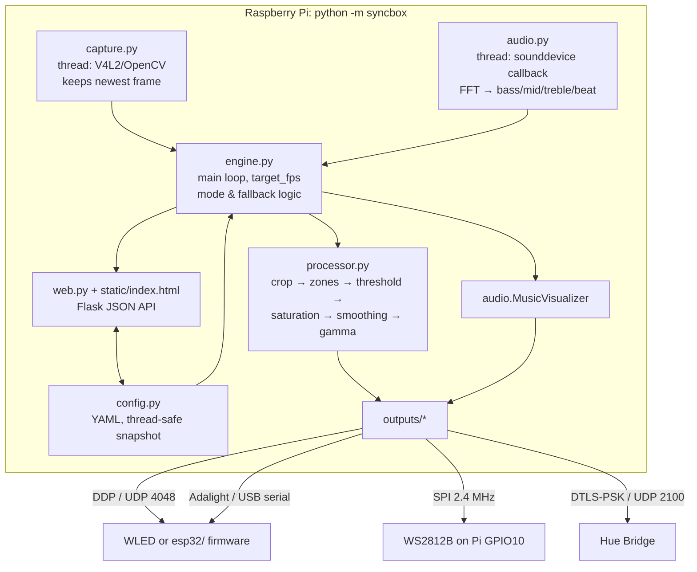

# 3. Software architecture

## 3.1 Overview

Two programs:

- **`pi/syncbox`** (Python, on the Raspberry Pi): capture, analysis, web UI, outputs. About 1,200 lines.
- **LED receiver** on the ESP32: WLED (recommended) or the 150-line firmware in `esp32/`.

They talk over UDP using DDP, the same wire protocol Hyperion/HyperHDR/xLights use, so any of those can replace either side.



## 3.2 Threads and timing

| Thread | Rate | Job |
|---|---|---|
| capture | as fast as the card delivers (30 or 60 fps) | `cap.read()`, store newest frame + sequence number + timestamp. Reopens the device after 30 consecutive failures |
| audio (PortAudio callback) | every 1024 samples (about 47 Hz at 48 kHz) | FFT, band energies, AGC, beat detection. Writes a features dict under a lock |
| engine (main thread) | `target_fps` (30) | reads the newest frame if its sequence changed, runs the processor, sends to outputs, updates status |
| web (Flask) | on request | reads/writes config, serves status and the LED preview |

The engine never blocks on capture: if no new frame has arrived it re-runs the smoothing step on the last raw colours, so LED updates stay smooth even when the capture card hiccups. Config changes are picked up via a version counter; changing the LED layout, capture or output sections rebuilds only the affected objects.

## 3.3 The colour pipeline in detail

`processor.VideoProcessor.extract()` runs once per new frame:

```
frame (640x360 BGR)
  └─ resize_area → 256x144            INTER_AREA, ~0.3 ms
  └─ luminance → BlackBarDetector      rows/cols with mean luma > 18 define the content
  │    (symmetric, ≤30 % per side, must be stable 15 frames; then crop + resize again)
  └─ ZoneSampler.sample()              summed-area table → mean RGB of every LED rect, one numpy op
  └─ scene_luma EMA                    for content-adaptive brightness
→ raw (N,3) float 0..255
```

`processor.VideoProcessor.process()` runs every engine tick:

```
raw
  └─ apply_black_threshold(t)          (c - t) * 255/(255 - t), clipped: noise floor → black
  └─ adjust_saturation(s)              gray + (c - gray) * s
  └─ content brightness                c * (0.35 + 0.65 * min(1, 2 * scene_luma))
  └─ Smoother.step(dt, tau_up, tau_down)
  │      alpha = 1 - exp(-dt / tau)    per channel; rising → tau_up, falling → tau_down
  └─ spatial_blur(passes)              [1,2,1]/4 along the strip
  └─ gamma                              (c/255)^gamma
  └─ brightness, clip → uint8
```

Why these choices:

- **Summed-area table** instead of per-zone slicing: one `cumsum` over the small frame, then four gathers. 300 zones cost the same as 10. On a Pi 4 the whole `extract` + `process` pair is about 3 ms.
- **Asymmetric smoothing** is what makes a sync box feel right. Explosions must light up instantly (short `tau_up`), fades to black should linger (longer `tau_down`). Game / Video / Movie are just three presets of these two numbers; the intensity presets scale them.
- **Frame-rate independent** filter (`1 - exp(-dt/tau)`) means the feel does not change when the capture card drops from 60 to 30 fps.
- **Black threshold before saturation** so noise does not get amplified into coloured speckle.
- **Gamma last**, on the smoothed linear-ish values, so mid-tones are not crushed before the filter.

### Intensity presets

| Preset | saturation x | brightness x | smoothing x | black threshold x |
|---|---|---|---|---|
| subtle | 0.9 | 0.6 | 2.0 | 1.5 |
| moderate | 1.0 | 0.8 | 1.3 | 1.0 |
| high | 1.2 | 1.0 | 1.0 | 1.0 |
| extreme | 1.5 | 1.0 | 0.5 | 0.5 |

### Modes

| Mode | Source | Notes |
|---|---|---|
| game | video | tau 20/60 ms |
| video | video | tau 80/200 ms |
| movie | video | tau 300/600 ms |
| music | audio | `MusicVisualizer`: hue drifts with treble, brightness follows a bass envelope, beats flash towards white. `spectrum` style maps strip position to bass/mid/treble |
| static | none | one colour, smoothed |
| calibrate | none | top red, right green, bottom blue, left yellow, first 3 LEDs white |

In video modes with audio enabled, `audio.react_in_video` adds `1 + bass_boost * bass + beat_flash * flash` to the brightness, where `flash` decays over about 170 ms after each beat.

### Fallback

`signal` is true when a frame arrived within `capture.signal_timeout` seconds **and** the picture has not been solid black for longer than `capture.black_timeout`. When it is false in a video mode, `fallback.when_no_signal` selects `static` (fallback colour), `off`, or `music`. WLED additionally has its own fallback: when DDP packets stop for its realtime timeout it resumes its previous preset, so if the Pi itself dies the strip returns to whatever WLED was showing.

## 3.4 Audio analysis

`audio.BandAnalyzer.analyze(block)`:

1. Hann window, real FFT of 1024 samples (about 21 ms at 48 kHz, 47 Hz frequency resolution).
2. Mean magnitude in bass 20 to 200 Hz, mid 200 to 2000 Hz, treble 2 to 16 kHz.
3. Per-band automatic gain: a peak tracker that decays by 0.5 % per block, so a quiet film and a loud game both normalise to 0..1.
4. Beat: the raw bass energy exceeds 1.35x its mean over the last second, is above 15 % of the running peak, and at least 120 ms have passed since the last beat. Simple onset detection; good enough for pulses, not for tempo tracking.

`AudioAnalyzer` wraps this in a `sounddevice.InputStream`. The `ms2109_fix` option handles capture cards that report 96 kHz mono for what is really 48 kHz stereo.

## 3.5 Output protocols

| Output | File | Protocol | Notes |
|---|---|---|---|
| WLED | `outputs/wled_ddp.py` | DDP, UDP 4048. 10-byte header: flags `0x41` (v1 + push), seq, type `0x0B` (RGB 8-bit), dest 1, 32-bit offset, 16-bit length | 480 pixels per packet, multiple packets per frame with PUSH on the last. Resamples to `outputs.wled.leds` if that differs from the layout |
| Adalight | `outputs/adalight.py` | `"Ada"` + hi + lo + (hi^lo^0x55) + RGB, hi/lo = count-1 | WLED serial, Hyperion, this repo's firmware, Prismatik |
| Pi SPI | `outputs/rpi_spi.py` | WS2812B bit → 3 SPI bits at 2.4 MHz (1 = 110, 0 = 100), GRB order, 120 zero bytes as reset | Lookup-table encode, `spidev.writebytes2` |
| Hue | `outputs/hue_entertainment.py` | CLIP v2 REST to start/stop streaming; DTLS 1.2 PSK (identity = app key, PSK = client key) to UDP 2100; `HueStream` v2 messages with 16-bit RGB per channel at ≤ 25 Hz | Each Hue channel's `position` (x, y, z) is converted to an angle around the screen and mapped to the nearest LED zone. Override per channel with `channel_map` |

## 3.6 Configuration

`config.yaml` (created from defaults on first run, see `pi/config.example.yaml`). The web UI writes the same file. Every change is atomic (write temp, rename) and hot-reloaded.

Key sections: `capture`, `leds` (counts, start corner, direction, offset, border), `processing` (mode, intensity, brightness, saturation, gamma, black threshold, smoothing time constants per mode, static colour), `fallback`, `audio`, `outputs.{wled,adalight,spi,hue}`, `web`.

## 3.7 HTTP API

| Method | Path | Body / result |
|---|---|---|
| GET | `/api/status` | fps, signal, effective mode, content rect, output errors, audio features |
| GET | `/api/config` | full config |
| POST | `/api/config` | partial JSON, deep-merged and saved |
| POST | `/api/mode` | `{"mode": "game"}` |
| GET | `/api/preview` | current LED colours as hex + layout, for the UI's live strip preview |
| POST | `/api/hue/pair` | `{"bridge": "192.168.1.2"}` (optional, auto-discovers); press the bridge button first |
| GET | `/api/hue/areas` | Entertainment Areas with channel positions |

Anything on your network can drive it: a Home Assistant `rest_command`, a Stream Deck button, a shell script. Example:

```bash
curl -X POST -H 'content-type: application/json' -d '{"mode":"movie"}' http://syncbox.local:8080/api/mode
curl -X POST -H 'content-type: application/json' -d '{"processing":{"brightness":0.5}}' http://syncbox.local:8080/api/config
```

## 3.8 Latency budget

| Stage | Typical |
|---|---|
| HDMI splitter | < 1 ms |
| Capture card encode + USB transfer + MJPEG decode (1080p30) | 35 to 70 ms |
| Same at 720p60 | 20 to 35 ms |
| Processing | 3 ms |
| Wi-Fi UDP to ESP32 | 3 to 15 ms |
| WS2812B refresh, 260 LEDs | 8 ms |
| Smoothing (Game mode) | adds about one time constant, 20 ms |
| **Total, Game mode at 720p60** | **about 60 to 80 ms** |
| **Total, Movie mode at 1080p30** | about 100 to 400 ms, on purpose |

## 3.9 Extending it

- **New output**: subclass `outputs.Output`, implement `send(colors)`; register in `outputs.build_outputs`. Examples worth adding: E1.31/sACN, Art-Net, Govee/Nanoleaf/LIFX LAN protocols, Home Assistant lights via MQTT.
- **New effect**: add a branch in `engine.Engine.step()`; the layout's `rects`, `edges` and `zone_angles` give you geometry.
- **Different sampling**: `ZoneSampler` accepts any rectangles, so a two-strip or "only the top" layout is just a different `build_layout`.
- **HDR tone mapping**: apply a 3D LUT (HyperHDR ships one) to the 256x144 frame before `ZoneSampler`.
- **Performance**: the pure-numpy path handles 300 LEDs at 60 fps on a Pi 4. If you need more, `ZoneSampler.sample` is the place for `cv2.integral`, or move the whole thing to a `multiprocessing` worker.
